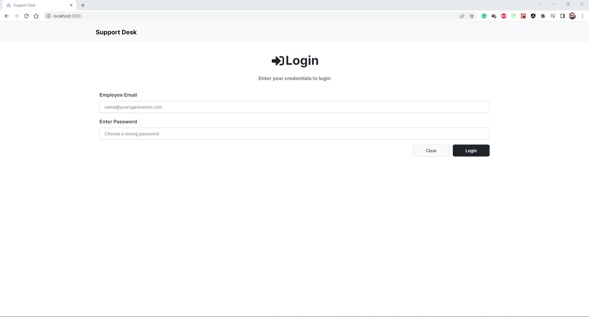
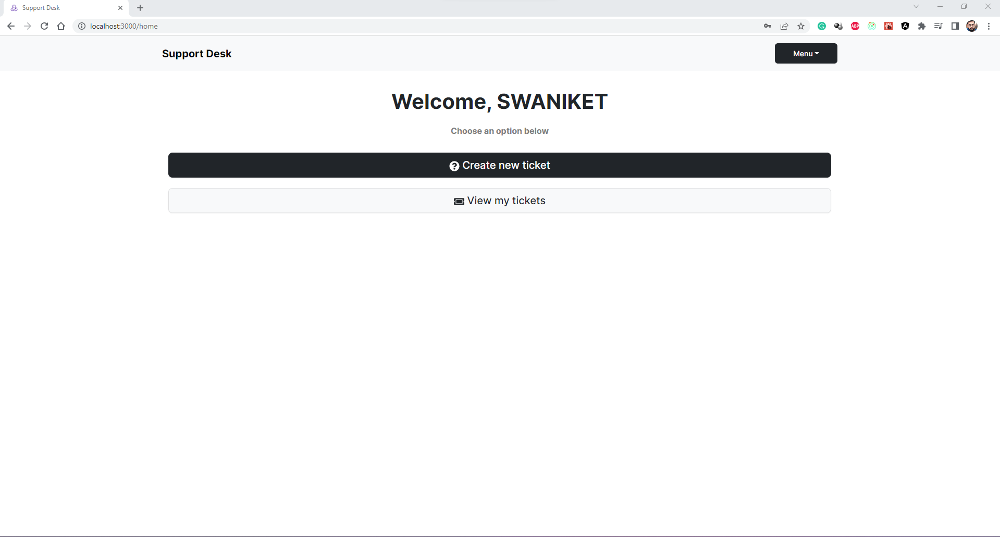
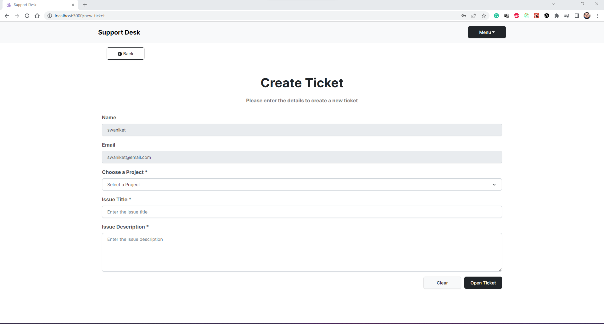
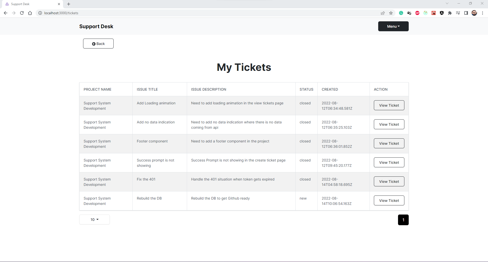
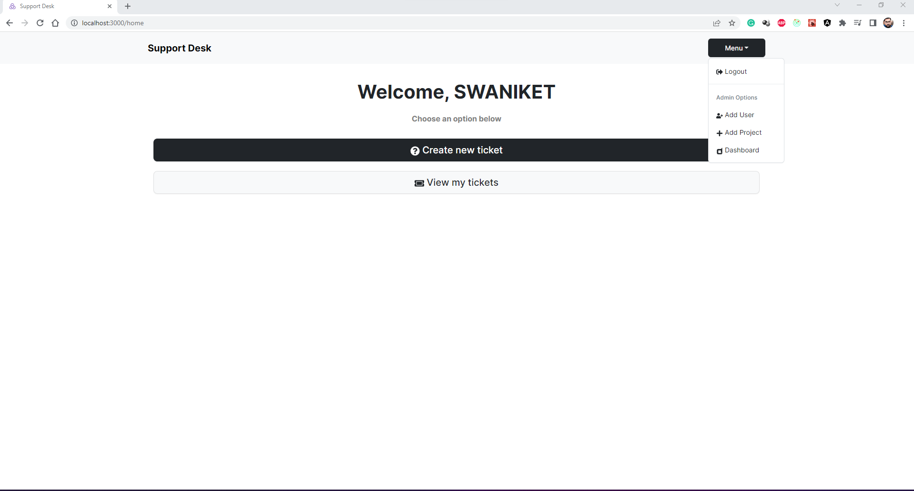
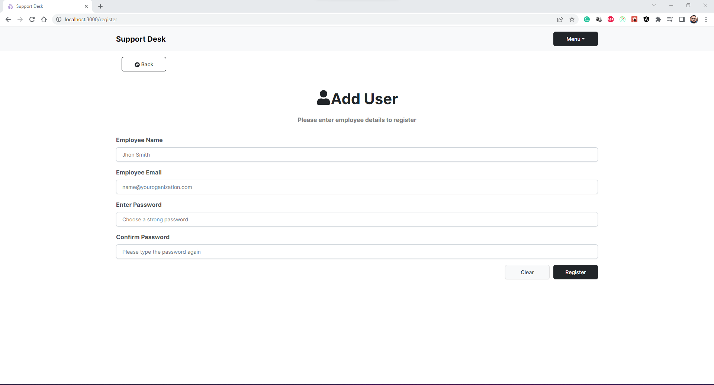
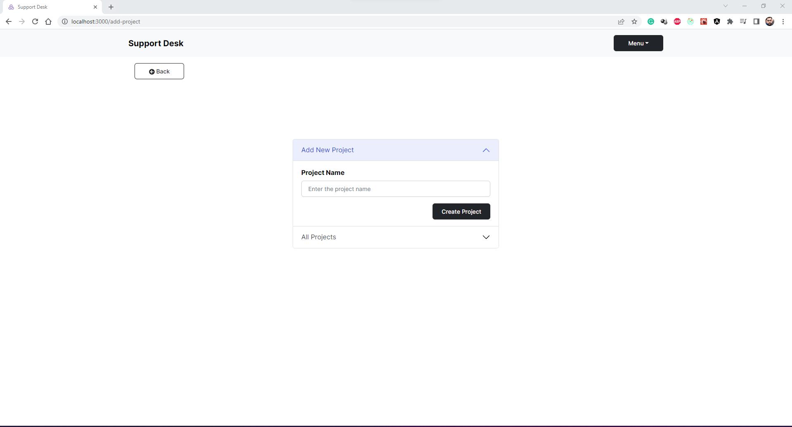
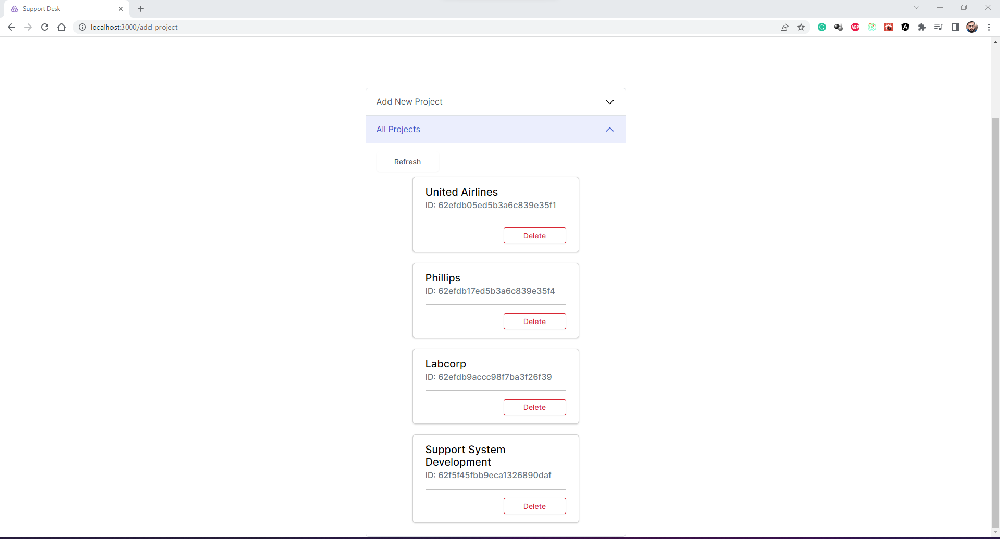
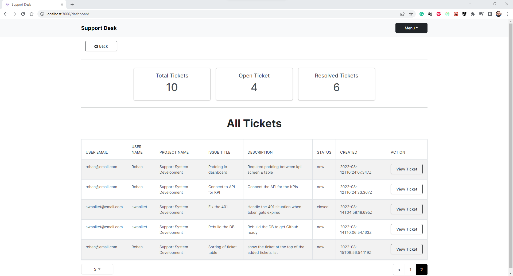
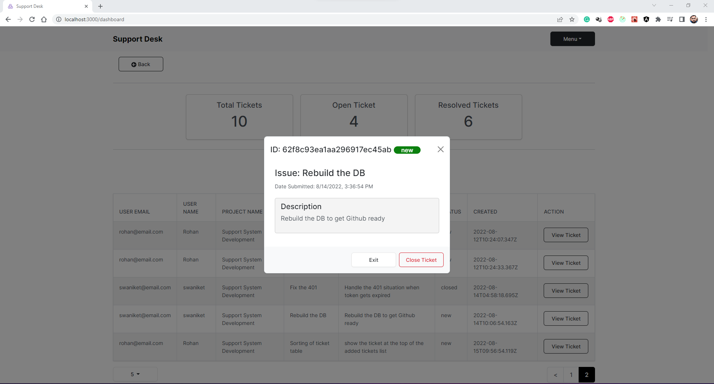

# Support Desk

Support Desk is a flexible ticketing system that can be used in small oranizations to keep track of the employee tickets for IT/HR/Management for instance.

### About

It has 2 types of user access in the app, `User Access` & `Admin Access`.

#### User Access

- Users can login to the application.
- Create a new ticket by selecting a perticular project.
- View all of the previous tickets created by that user.

##### Screens

###### Login Page

###### Home Page

###### Create New Ticket Page

###### View My Tickets Page

##### Admin Access

- All the same access as User.
- Additionally gets access to the admin modules/options.
- Admin Options includes, `Add a new user to the system`, `Add/Delete Projects`, and `Dashboard`.
- Dashboard has 3 different KPIs (Total number of tickets, Open tickets, Resolved tickets) and a table where admin user can see all the tickets raised by all the users (with their email address and name) and they have the option to change a ticket status to closed.

##### Screens

###### Admin Options

###### Add Users

###### Add New Project

###### View/Delete Projects

###### Dashboard

###### Dashboard -> Close Ticket

### Teck Stack

- ReactJS + React Router v6 + Bootstrap for the components
- Redux Toolkit
- Axios
- Node + Express JS

### To run the development server

- Create a `.env` file in the root directory with the following variables
    1. NODE_ENV - Put it as development
    2. PORT - The backend API port
    3. MONGO_URI - Your mongodb connection string
    4. JWT_SECRET - The secrect used to hash the password.

- Run `npm i` in the root directory to install backend dependencies.
- Run `npm i` in the frontend folder to install frontend dependencies.
- Run `npm run dev` (It will start the frontend and backend app together) in the root directory to run the project.